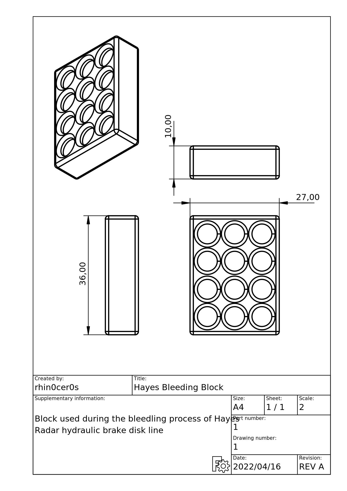

# Hayes Bleed Block
My daily bicycle that I ride everywhere in Marseille, from the street workout 
area to the bar, is a Decathlon RockRider 540 ```RR540 Blk XL``` that I bought 
back in around 2016.
It comes equipped with an hydraulic disk brake line from Hayes named 
```Radar```.

The front and back brakes were both spongy and braking had became kind of
inexistant, so I decided to change the pads and bleed them.

Unfortunately I could not find the bleeding block. I am not even sure that I
ever had them for starter ...

This was the perfect excuse to fire up the Anycubic ```vyper``` and print my
own.

## Quotes
I measured the quotes with a simple pair of calipers. It is very close and needs
to be forced pushed a bit.

## Slicing details
The most important paramater to set for this print is the infill pattern and
density. I went with the following ones :
- density : 25%
- pattern : octet

This was way too low since I smashed the block a bit during the bleeding. I was
able to get it out but it was close.

If you want to use it, do not hesitate to print with a higher density and/or a
more suitable pattern.

